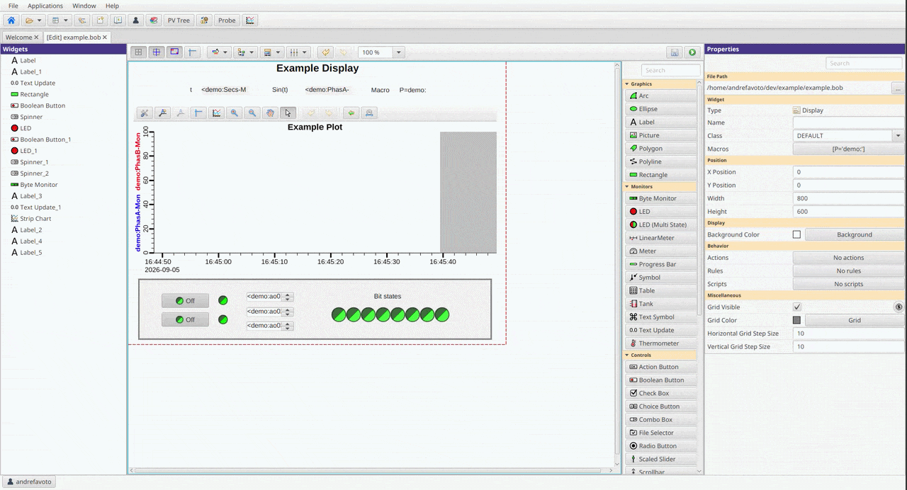
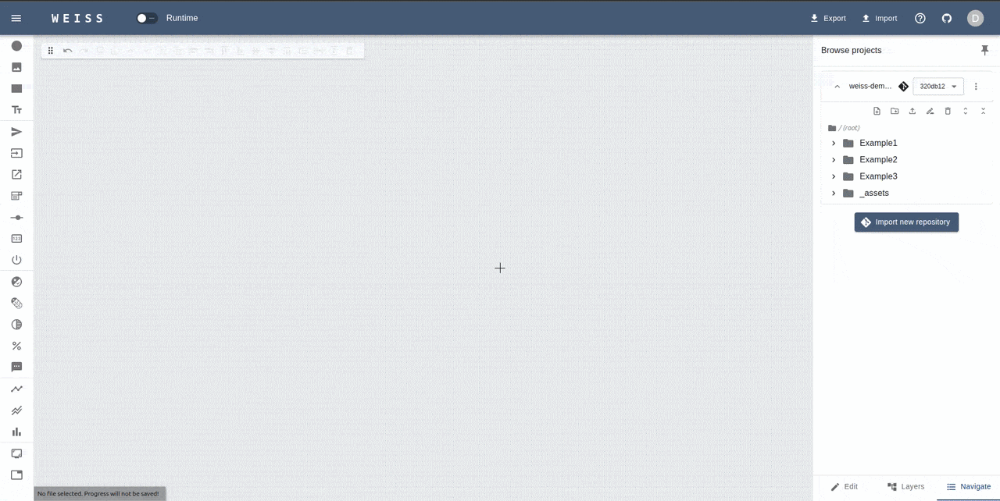

# Importing files

Especially for systems already in production, a common scenario is to have most displays - or even
all of them - already developed using the same tool. As much as one would want to have them ported
to a web-native application, redrawing everything in another tool can be very time-consuming task.

For that reason, WEISS provides methods to facilitate the import of existing displays from other
tools, reducing the manual effort required to recreate them in a web-native environment.

For now, WEISS supports importing displays from CS-Studio/Phoebus only, and other tools will be
considered in future updates.

## From CS-Studio

WEISS currently supports importing Phoebus Display Builder files (`.bob`), the display format used
by modern CS-Studio installations. The importer converts the display into WEISS widgets so you can
continue editing it in the browser or use it right away.

### Make sure you have things ready

Open the display you want to import in CS-Studio/Phoebus and check that it works as expected. **The
extension accepted is a `.bob` file only,** so check that it is also saved on this format.

Be sure to have all image files or embedded displays used by your OPI at hand, as they will also
need to be uploaded or imported.

<!-- TODO: Add an image showing a CS-Studio/Phoebus display ready to export. -->

### Import the display

With the WEISS app running, login as a "Developer" and create a new file with the desired name.
Click **Import** in the application header, select **From CSS/Phoebus**, and choose the `.bob` file
from your computer.

<!-- TODO: Replace the placeholder above with an import animation or screenshot. -->

Before the import starts, WEISS will show a warning that the result may require validation. Confirm
the message to continue. The converted widgets will be added to the current OPI.

:::{important} Not all Phoebus widgets and features are supported. The unsupported widgets will be
substituted by a dashed outline as placeholder, and a warning will be shown. Check next section for
details on supported widgets and features.

The goal of this tool is to reduce the manual effort required to recreate already existent displays,
but does not eliminate the need for checking and validating the imported application.  
:::

### Review the conversion

Inspect the imported display in the editor. Check the widget positions, dimensions, colors, fonts,
and text alignment, then open the properties sidebar for any PV names or display macros that need to
be updated.

If the importer finds limitations, WEISS will show a warning after the import. Review each warning
and adjust the affected widget manually. Unsupported widgets are not converted into functional WEISS
widgets.

The current widget suppor, to be extended, is:

| Phoebus type                          | WEISS widget                        | Status                                                |
| ------------------------------------- | ----------------------------------- | ----------------------------------------------------- |
| `label`                               | `TextLabel`                         | ✅                                                    |
| `textupdate`                          | `TextUpdate`                        | ✅                                                    |
| `textentry`                           | `InputField`                        | ✅                                                    |
| `action_button`                       | `ActionButton` / `NavigationButton` | ✅ map based on action type                           |
| `bool_button`                         | `ToggleButton`                      | ✅                                                    |
| `combo`                               | `SelectionBox`                      | ✅                                                    |
| `spinner`                             | `Spinner`                           | ✅                                                    |
| `scaledslider`                        | `Slider`                            | ✅                                                    |
| `led`                                 | `BitIndicator`                      | ✅                                                    |
| `multi_state_led`                     | `MultiStateLED`                     | ✅                                                    |
| `byte_monitor`                        | `MultiBitIndicator`                 | ✅                                                    |
| `progressbar`                         | `ProgressBar`                       | ✅                                                    |
| `rectangle`                           | `Rectangle`                         | ✅                                                    |
| `ellipse`                             | `Ellipse`                           | ✅                                                    |
| `picture`                             | `Image`                             | ✅                                                    |
| `embedded`                            | `EmbeddedDisplay`                   | ✅ `.bob` path rewritten to `.opi.json`               |
| `group`                               | `Group`                             | ✅                                                    |
| `xyplot`                              | `GraphXY`                           | 🔶 layout only — `pvNames`/`lineColors` not converted |
| `stripchart`                          | `GraphY`                            | 🔶 layout only — `pvNames`/`lineColors` not converted |
| `checkbox`                            | —                                   | 🔶 not implemented                                    |
| `choice`                              | —                                   | 🔶 not implemented                                    |
| `meter`                               | —                                   | 🔶 not implemented                                    |
| `linearmeter`                         | —                                   | 🔶 not implemented                                    |
| `tank`                                | —                                   | 🔶 not implemented                                    |
| `thermometer`                         | —                                   | 🔶 not implemented                                    |
| `array`                               | —                                   | 🔶 not implemented                                    |
| `image`                               | —                                   | 🔶 not implemented                                    |
| `tabs` / `navtabs`                    | —                                   | 🔶 not implemented                                    |
| `slide_button`                        | —                                   | 🔶 not implemented                                    |
| `thumbwheel`                          | —                                   | 🔶 not implemented                                    |
| `radio`                               | —                                   | 🔶 not implemented                                    |
| `table`                               | —                                   | 🔶 not implemented                                    |
| `polyline`                            | —                                   | 🔶 not implemented                                    |
| `template`                            | —                                   | 🔶 not implemented                                    |
| `3d viewer`                           | —                                   | 🔶 not implemented                                    |
| `fileselector`                        | —                                   | ❌ won't implement                                    |
| `text-symbol`                         | —                                   | ❌ won't implement                                    |
| `symbol`                              | —                                   | ❌ won't implement                                    |
| `scrollbar`                           | —                                   | ❌ won't implement                                    |
| `databrowser` / `waterfallplotwidget` | —                                   | ❌ won't implement                                    |
| `arc`                                 | —                                   | ❌ won't implement                                    |
| `polygon`                             | —                                   | ❌ won't implement                                    |
| `webbrowser`                          | —                                   | ❌ won't implement                                    |

### Add related files

If the display uses pictures, upload the corresponding `.svg`, `.png`, `.jpg`, or `.jpeg` files to
the same repository. Make sure the paths used by the imported `Image` widgets match the paths of the
uploaded files.

For embedded displays, import each referenced `.bob` file using the same proccess as the main
display. Make sure the path on the main display matches the location of the imported files.

### Test and save

After checking PV names and macros, switch to **Runtime** mode and verify that the imported widgets
connect to their PVs and behave as expected.

When the display is ready, save it in the repository. You can then commit and deploy it using the
workflow described in the [first web OPI tutorial](tutorial.md).

:::{warning}  
An imported display should be treated as a starting point. Always test it with the intended IOC and
review the complete display before making it available to operators.  
:::
