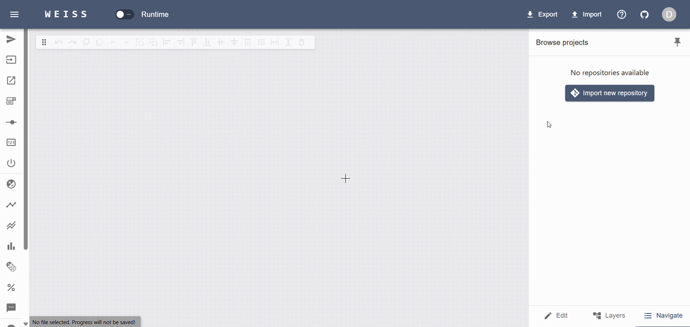
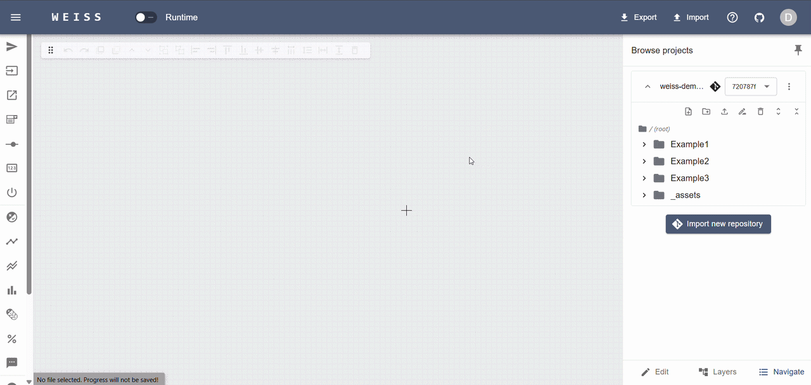
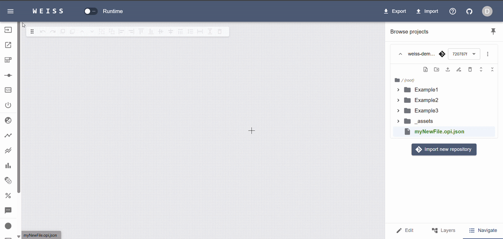
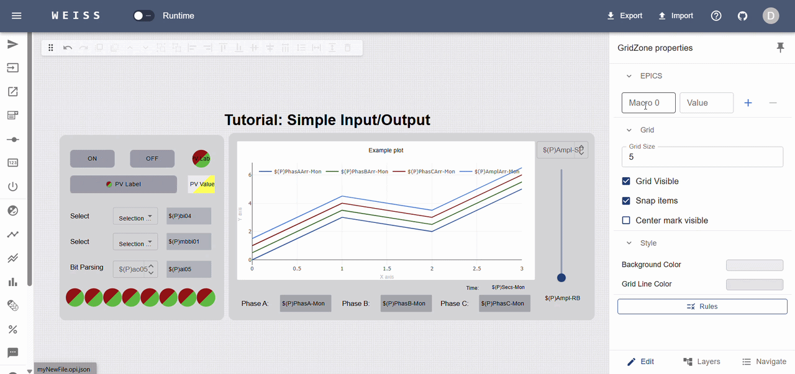
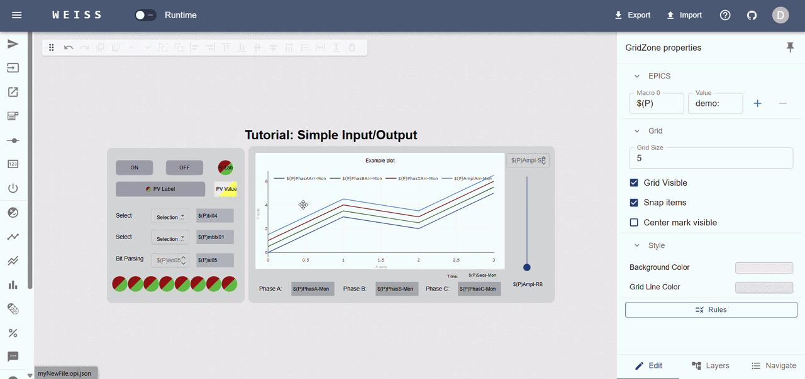
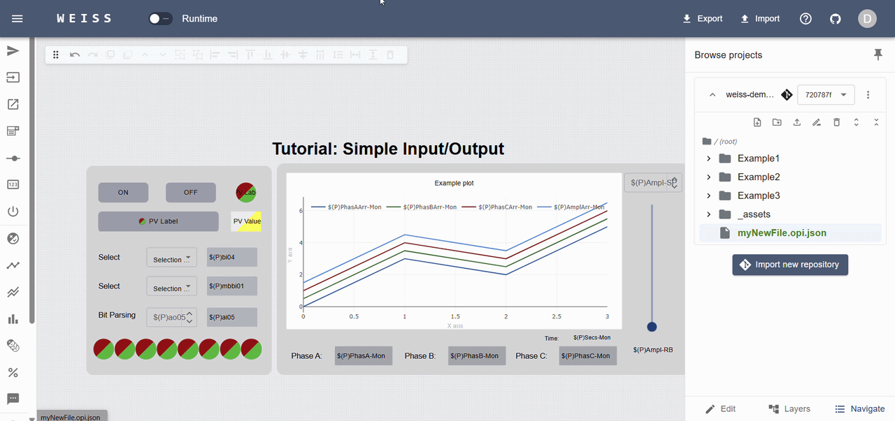
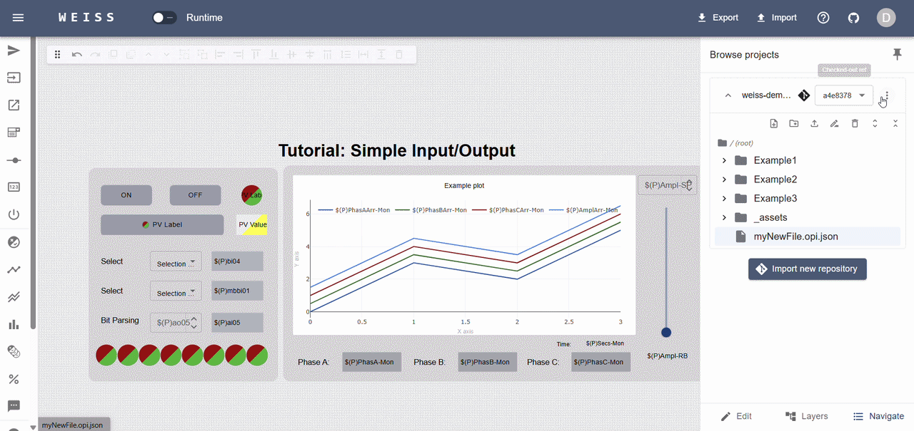

# Tutorial - build your first web OPI

This section will guide you through creating your first OPI using WEISS.

:::{note}  
Optional: For a full experience, it is recommended that you follow this tutorial in a local instance
of WEISS, with the proper [Git credentials](../production/git_interaction.md) configured, so you can
push to remote repos directly from the user interface.

If you don't want to do this now, you can still follow along with the
[public demo](https://demo.weiss-controls.org), but you will not be able to push your changes from
UI or use private repositories.  
:::

## Start a new project

Create a new repository on your preferred git hosting service (GitHub, GitLab, etc.), and put it
into a namespace where your Git settings have access to (if applicable). Make sure to add at least
one file to it, e.g. a `README.md` or `.gitignore`, so it is not empty.

:::{tip}  
 Alternatively, you can create a fork of
[weiss-demo-opis](https://github.com/weiss-controls/weiss-demo-opis) to use as a playground.  
 :::

With WEISS app running, login as a "Developer" and click on the "Import new repository" button in
the right sidebar of the "Navigate" tab. Provide the repository's HTTPS URL and an alias for it,
then click "Import".

## Create a new OPI

Once the repository is imported, you can see its content in the file browser (if any). Note that not
all file types will be visible, so you may see an empty repository even if it is not. The file types
supported by WEISS are:

- **OPI files** - files with the `.opi.json` extension.
- **Image files** - files with the `.svg`, `.png`, `.jpg`, or `.jpeg` extension.

Create your new OPI file by clicking "New File" on the navigator sidebar and providing a name when
prompted. You may also create subfolders to organize your content, and reorganize items by drag and
drop. The supported file extension for OPI files is `.opi.json`, but you can omit it when creating a
new file, as WEISS will automatically append it if missing.

:::{note}  
 As part of the git-oriented system, WEISS will highlight the new file name with green. Modified
files will be highlighted in yellow.  
:::

## Design your OPI

Open the newly created OPI file by clicking on it in the file browser. You will be presented with a
blank canvas where you can start designing your interface. Start by adding a widget from the left
sidebar. You can either drag and drop it onto the canvas, or click on it to add it where the mouse
pointer is. You can move, resize, and configure the widget using the right sidebar.

Tools for alignment, grouping, resizing and layering are available in the floating toolbar at the
top of the canvas, or with the right-click menu. You can also use keyboard shortcuts for common
actions (see help icon on the upper-right side of the app header).

## Create PV connections

Configure your OPI macros (if any) by clicking on an empty space in the canvas. The right sidebar
will show the "GridZone" properties, such as the macros, grid size, snapping, background color, etc.
Make sure to set the PV names of your widgets as well, according to the IOC you have running. For
the demonstration OPIs, the IOCs can be found in
[weiss-demo-iocs](https://github.com/weiss-controls/weiss-demo-iocs).

## Test it

For testing connection and functionality, hit the "Runtime" switch. The app will instantly open a
connection to the PVs and start updating the widgets accordingly.

:::{hint}  
 If your PVs are not connecting, check if your IOC can be seen from the server running WEISS. You
may need to update the `EPICS_XXX_ADDR_LIST` environment variables in your `.env` file to include
the IOC's address or appropriate gateway.  
If change is needed, update the variables then update the containers with
`docker compose up -d --build`. The local volume will persist your repository files, so you won't
lose your work in progress.  
:::

## Commit & push your changes

This step is only possible if you have completed the
[Git credentials setup](../production/git_interaction.md) and your PAT has write access to the
repository you are working on.

If you are happy with your changes, you can create a new commit by clicking the "Commit" button in
the repository additional options menu. Provide a commit message, optionally a tag, and click
"Commit". The commit will be created and pushed to the upstream repository.

After seeing the successful message, you can click the dropdown close to the repository alias, and
see that the repository history is now updated.

Besides committing, you can also revert local changes or fetch the latest changes from upstream.
These options are available in the same menu.

:::{warning}  
To keep things simple, WEISS **does not** support branching or conflict resolution in the UI. If
conflicts arise, a notification will be shown, and you will need to resolve it manually by cloning
the repository and pushing afterwards.  
To avoid this, it is a good practice to always pull the latest changes before starting to work, and
avoid working on the same file in parallel with other developers.  
:::

## Deploy to users!

After committing your changes, you can select the commit or tag you want to deploy to production,
and click "Deploy" on the same menu. WEISS will create a snapshot of the repository at that commit
and make it available to all users with the "Operator" role.

To verify that it works, if running on "Demo" mode, you can logout and login as an "Operator" to see
the deployed repository available for usage. Alternatively, you can open a new browser window in
incognito mode and access the app with an "Operator" user simultaneously.

:::{seealso}  
**Rollbacks:** If a version needs to be rolled back, just select the previous commit/tag, and click
"Deploy" again.  
**Undeployments:** You may also undeploy a repository by selecting the "Undeploy" option in the same
menu.  
:::

---

This tutorial showed the basic workflow of creating a simple OPI and deploying it to users.
Documentation for more advanced features such as embedded displays, rules and complex macro handling
will be available in the future. If you have any questions or suggestions, please reach out through
GitHub!
