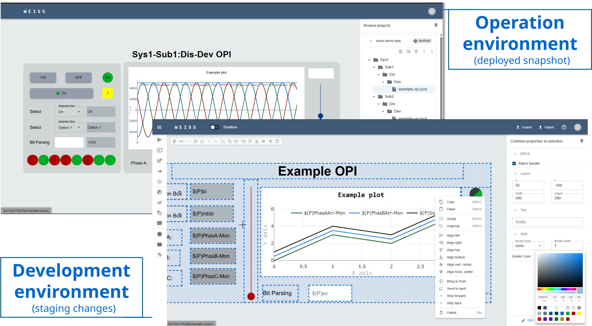

# WEISS - Web EPICS Interface & Synoptic Studio

WEISS is a no-code, drag-and-drop system for building web-based EPICS operation interfaces. It
provides a responsive editor, git-based OPI versioning, live PV communication and a lightweight
deployment model.

|                             Live demo                              |                                Source code                                 |                               Planned features                                |
| :----------------------------------------------------------------: | :------------------------------------------------------------------------: | :---------------------------------------------------------------------------: |
| [https://demo.weiss-controls.org](https://demo.weiss-controls.org) | [github.com/weiss-controls/weiss](https://github.com/weiss-controls/weiss) | [GitHub Project Dashboard](https://github.com/orgs/weiss-controls/projects/1) |



---

## Motivation

### Why WEISS?

It's known that the EPICS ecosystem has mature desktop tools for building operator interfaces.
However, web-based OPIs in EPICS are still constrained by fragmented workflows. Existing solutions
either require actually writing code to build screens or depend on desktop tools for designing, with
the browser acting only as a runtime environment.

WEISS removes this limitation. It delivers a fully browser-based environment for creating, testing,
and deploying operator interfaces. Engineers can design synoptics with drag-and-drop widgets,
connect them to live PVs, and publish updates instantly - all without leaving the browser or
installing local tools.

WEISS also redefines deployment. Interfaces are versioned in git, developed in staging, and promoted
to production with a single action. Operators only access approved versions, ensuring controlled
releases with full traceability.

This approach consolidates the full interface lifecycle - design, validation, and deployment -
within a single, consistent web-based environment.

### Why should you use web?

- **Client-side rendering**: the client browser performs most work; backend load stays minimal.
- **Ease of access**: use any modern browser - no remote desktops or local tools required. Access
  control relies on standard security mechanisms (network restrictions, authentication, reverse
  proxies, etc).
- **Built for scale**: concurrent users do not require dedicated VMs or graphical sessions.
- **Global ecosystem**: web technologies have one of the largest developer ecosystems, offering
  libraries, tools, and best practices beyond the scientific environment niche.
- **Integration friendly**: easy to connect with authentication systems (LDAP), GitHub/GitLab, and
  other modern tools.

---

## Key Features

- **Drag-and-drop editor** with grid snapping, alignment, grouping, layering, keyboard shortcuts.
- **Live EPICS PV communication**: supports both Channel Access (CA) and PV Access (PVA) protocols
  via community-validated implementations [p4p](https://github.com/epics-base/p4p/) and
  [PyEpics](https://pyepics.github.io/pyepics/).
- **Runtime vs edit mode**: instantly start and stop communication with a switch button.
- **Git-based versioning**: developers can import repositories, edit OPIs, and commit changes
  directly without leaving the app. Repositories can be public or private.
- **Deployment management**: promote specific commits to production with a single click. Operators
  only interact with the production version, ensuring controlled releases.
- **Extensible widget library**: ready-to-use components for common controls and displays, others
  can be easily created.
- **Portable JSON format**: import, export or create OPIs programatically using straightforward JSON
  files.

Further planned improvements are tracked in the
[WEISS Project Dashboard](https://github.com/orgs/weiss-controls/projects/1/).

## Extra

- Some references used for this project:
  - [Taranta](https://gitlab.com/tango-controls/web/taranta),
  - [React Automation Studio](https://github.com/React-Automation-Studio/React-Automation-Studio),
  - [PVWS](https://github.com/ornl-epics/pvws),
  - [pyDM](https://github.com/slaclab/pydm),
  - [Phoebus](https://github.com/ControlSystemStudio/phoebus).

```{toctree}
:maxdepth: 3
:hidden:
:name: getting-started
:caption: Getting Started

getting_started/quickstart
```

```{toctree}
:maxdepth: 3
:hidden:
:name: production-setup
:caption: Production Setup

production/env_variables
production/https
production/org_credentials
production/user_roles
production/git_interaction
```

```{toctree}
:maxdepth: 3
:hidden:
:name: for-devs
:caption: For developers

developer/architecture
developer/contributing
developer/source
developer/creating_widget
```
